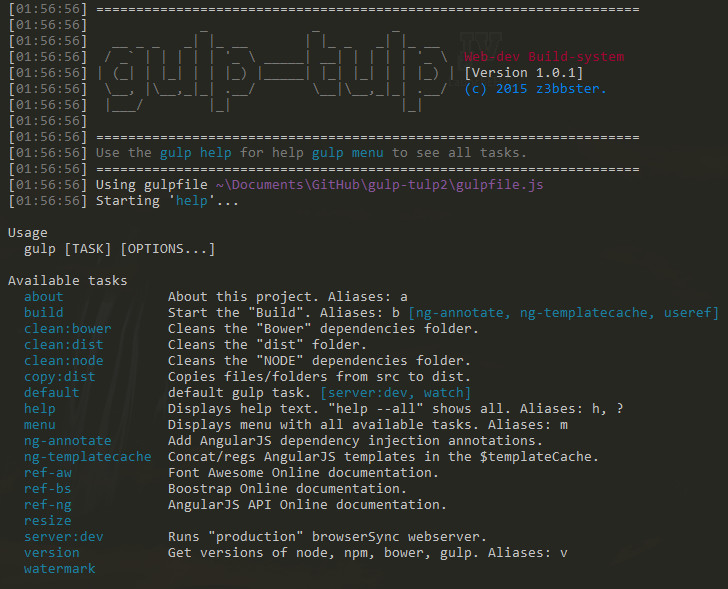
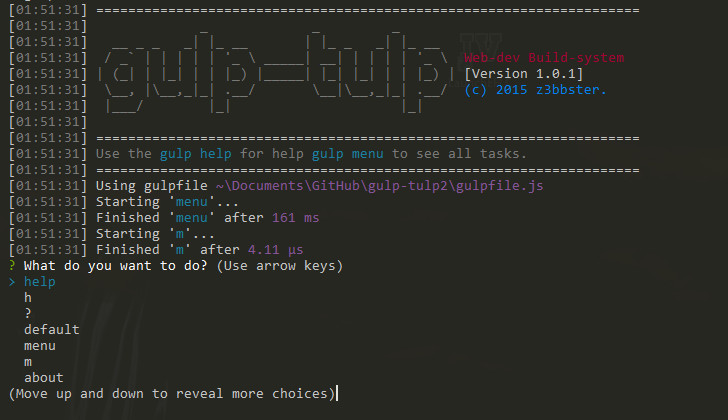

# gulp-tulp

[](https://gemnasium.com/z3bbster/gulp-tulp) [](https://gitter.im/z3bbster/gulp-tulp?utm_source=badge&utm_medium=badge&utm_campaign=pr-badge&utm_content=badge)


[Getting Started](#getting-started) | [Roadmap](#roadmap)  | [Bug tracker](#bug-tracker) | [Authors](#authors) | [Contributing](#contributing) | [License](#copyright-and-license) | [Submit Idea](https://github.com/z3bbster/gulp-tulp/issues)

> GULP-TULP - A [Gulp](http://gulpjs.com/) only miniscule commandline build system for a fast, quick and easy no-nosense automated and enhance AngularJS web development workflow. There are over 20+ gulp tasks at your desposal to direct your app development and production/distrubution needs. 

Supports for:
+ BrowserSync with live reload (no plugin required)
+ HTML, CSS,JS code minification
+ Less preprocessing
+ Graphic assets optimasation
+ Javascript code hinting
+ AngularJS specific tasks

## Getting Started

:wrench: [Download and install node.js 0.8.0+](http://nodejs.org/download/) before proceeding.

All available quick start options: 

+ Create a new project folder `mkdir myproject`.
+ Browse to the project `cd myproject`.
+ Clone the gulp-tulp repo: `git clone git@github.com:z3bbster/gulp-tulp.git`.
+ Install node dependecies `npm install`.
+ Install bower dependecies `bower install`.
+ Start gulp-tulp default task `gulp` and begin development.

*Example gulp-tulp help*



*Example gulp-tulp menu*



## Roadmap

- [ ] Create gulp-tulp as gobal npm package 
- [x] Seperate gulptask files in gulp folder
- [x] Better and useful Gulp error handling
- [ ] Dgeni documentation generation
- [ ] Icon webfont generation
- [ ] Gulp-local-screenshots support
- [ ] Replace flatten with gulp-angular-dep

## Bug tracker

:postbox: Have a bug, enhancement, idea or question? Please create an issue here on GitHub!

https://github.com/z3bbster/gulp-tulp/issues

## Authors

:busts_in_silhouette: **z3bbster**

## Contributing

1. Fork it `git fork git@github.com:z3bbster/gulp-tulp.git`
2. Create your feature branch: `git checkout -b my-new-feature`
3. Commit your changes: `git commit -am 'Add some feature'`
4. Push to the branch: `git push origin my-new-feature`
5. Create new Pull Request

## Copyright and license

Copyright (c) 2015, z3bbster
All rights reserved.

Redistribution and use in source and binary forms, with or without
modification, are permitted provided that the following conditions are met:

1. Redistributions of source code must retain the above copyright notice, this
   list of conditions and the following disclaimer. 
2. Redistributions in binary form must reproduce the above copyright notice,
   this list of conditions and the following disclaimer in the documentation
   and/or other materials provided with the distribution.

```
THIS SOFTWARE IS PROVIDED BY THE COPYRIGHT HOLDERS AND CONTRIBUTORS "AS IS" AND
ANY EXPRESS OR IMPLIED WARRANTIES, INCLUDING, BUT NOT LIMITED TO, THE IMPLIED
WARRANTIES OF MERCHANTABILITY AND FITNESS FOR A PARTICULAR PURPOSE ARE
DISCLAIMED. IN NO EVENT SHALL THE COPYRIGHT OWNER OR CONTRIBUTORS BE LIABLE FOR
ANY DIRECT, INDIRECT, INCIDENTAL, SPECIAL, EXEMPLARY, OR CONSEQUENTIAL DAMAGES
(INCLUDING, BUT NOT LIMITED TO, PROCUREMENT OF SUBSTITUTE GOODS OR SERVICES;
LOSS OF USE, DATA, OR PROFITS; OR BUSINESS INTERRUPTION) HOWEVER CAUSED AND
ON ANY THEORY OF LIABILITY, WHETHER IN CONTRACT, STRICT LIABILITY, OR TORT
(INCLUDING NEGLIGENCE OR OTHERWISE) ARISING IN ANY WAY OUT OF THE USE OF THIS
SOFTWARE, EVEN IF ADVISED OF THE POSSIBILITY OF SUCH DAMAGE.
```

The views and conclusions contained in the software and documentation are those
of the authors and should not be interpreted as representing official policies, 
either expressed or implied, of the FreeBSD Project.
