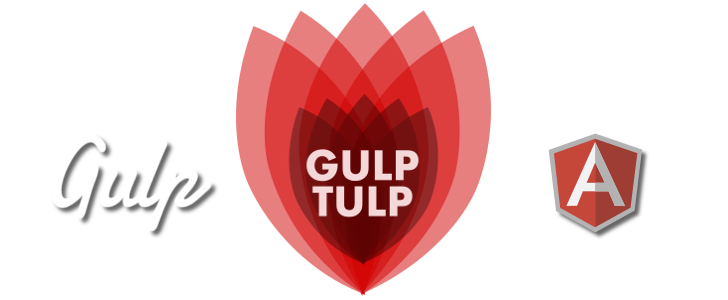

# gulp-tulp [](https://gemnasium.com/z3bbster/gulp-tulp) [](https://gitter.im/z3bbster/gulp-tulp?utm_source=badge&utm_medium=badge&utm_campaign=pr-badge&utm_content=badge)



[Getting Started](#getting-started) | [Roadmap](#roadmap)  | [Bug tracker](#bug-tracker) | [Authors](#authors) | [Contributing](#contributing) | [License](#copyright-and-license) | [Submit Idea](https://github.com/z3bbster/gulp-tulp/issues)

> GULP-TULP - A [Gulp](http://gulpjs.com/) only build system for a fast, quick and easy no-nosense automated and enhance AngularJS web development workflow.

## Getting Started

:wrench: [Download and install node.js 0.8.0+](http://nodejs.org/download/) before proceeding.

All available quick start options: 

+ Clone the repo: `git clone git@github.com:z3bbster/gulp-tulp.git`.
+ Download the latest [release](https://github.com/z3bbster/gulp-tulp/zipball/master).
+ Clone in [Desktop](github-windows://openRepo/https://github.com/z3bbster/gulp-tulp).

List of all available and future gulp-tulp commands:

- [x] `gulp server:dev` - Development webserver with live reload
- [x] `gulp server:dist` - Distrubution webserver with live reload
- [x] `gulp server:doc` - Documentation webserver with live reload
- [x] `gulp server:dev` - Automatically watch all development files
- [x] `gulp bower` or `gulp bower:dev` -  bower support install and update components
- [x] `gulp server:dev` - Minify HTML, CSS, JS files
- [x] `gulp imagemin` - Optimize graphical bitmap and vector assets 
- [x] `gulp less` - LESS preprocessor task with live reload
- [ ] `gulp ng-annotate` - AngularJS auto ng-annotate support
- [ ] `gulp ng-templateCache` - AngularJS auto templateCache support
- [ ] `gulp bump` - version bump major, minor support
- [ ] `gulp git` - full git support
- [x] File revision support

## Roadmap

- [] Seperate gulptask files in gulp folder
- [] Better and useful Gulp error handling
- [] Dgeni documentation generation
- [] Icon webfont generation
- [] Speed test support

## Bug tracker

:postbox: Have a bug, enhancement, idea or question? Please create an issue here on GitHub!

https://github.com/z3bbster/gulp-tulp/issues

## Authors

:busts_in_silhouette: **z3bbster**

## Contributing

1. Fork it
2. Create your feature branch: `git checkout -b my-new-feature`
3. Commit your changes: `git commit -am 'Add some feature'`
4. Push to the branch: `git push origin my-new-feature`
5. Create new Pull Request

## Copyright and license

Copyright (c) 2015, z3bbster
All rights reserved.

Redistribution and use in source and binary forms, with or without
modification, are permitted provided that the following conditions are met:

1. Redistributions of source code must retain the above copyright notice, this
   list of conditions and the following disclaimer. 
2. Redistributions in binary form must reproduce the above copyright notice,
   this list of conditions and the following disclaimer in the documentation
   and/or other materials provided with the distribution.

```
THIS SOFTWARE IS PROVIDED BY THE COPYRIGHT HOLDERS AND CONTRIBUTORS "AS IS" AND
ANY EXPRESS OR IMPLIED WARRANTIES, INCLUDING, BUT NOT LIMITED TO, THE IMPLIED
WARRANTIES OF MERCHANTABILITY AND FITNESS FOR A PARTICULAR PURPOSE ARE
DISCLAIMED. IN NO EVENT SHALL THE COPYRIGHT OWNER OR CONTRIBUTORS BE LIABLE FOR
ANY DIRECT, INDIRECT, INCIDENTAL, SPECIAL, EXEMPLARY, OR CONSEQUENTIAL DAMAGES
(INCLUDING, BUT NOT LIMITED TO, PROCUREMENT OF SUBSTITUTE GOODS OR SERVICES;
LOSS OF USE, DATA, OR PROFITS; OR BUSINESS INTERRUPTION) HOWEVER CAUSED AND
ON ANY THEORY OF LIABILITY, WHETHER IN CONTRACT, STRICT LIABILITY, OR TORT
(INCLUDING NEGLIGENCE OR OTHERWISE) ARISING IN ANY WAY OUT OF THE USE OF THIS
SOFTWARE, EVEN IF ADVISED OF THE POSSIBILITY OF SUCH DAMAGE.
```

The views and conclusions contained in the software and documentation are those
of the authors and should not be interpreted as representing official policies, 
either expressed or implied, of the FreeBSD Project.

[](https://bitdeli.com/free "Bitdeli Badge")

